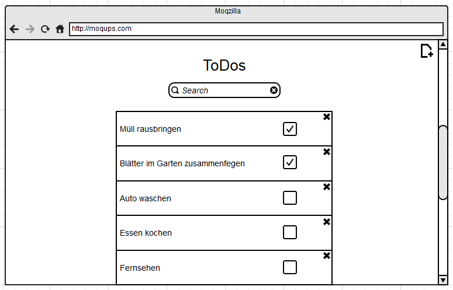

Konzepte
========

Fachliche Strukturen und Modelle
--------------------------------

Typische Muster und Strukturen
------------------------------

Persistenz
----------

Userinterface
-------------

Die folgenden Userinterfaces sind zu unterscheiden.
* Web
* Mobile
* Administration

##### Web
Das Web-Userinterface ist einfach gehalten. Nachdem sich ein Nutzer angemeldet hat, stehen ihm die folgenden Funktionen zur Verfügung:

* Ansicht der bereits eingegebenen ToDos (in einer Liste)
* Hinzufügen eines neuen ToDos
* Editieren eines bereits eingegebenen ToDos
* "Abhaken" eines erledigten ToDos.
* "Löschen" eines ToDos.

Die nachfolgende Abbildung skizziert die Ansicht von ToDos.

 
_Abbildung: ToDo-Liste im Web_

Jedes ToDo kann hierbei über die Checkbox als "erledigt" gekennzeichnet werden. Des Weiteren kann über das kleine "x" (in der oberen rechten Ecke) ein Todo aus der Liste gelöscht werden.

Neue ToDos können über das "Plus" Icon in der oberen rechten Ecke der Webseite hinzugefügt werden. Nutzer, die lieber intensiv die Tastatur verwenden, können auch über die Numpad-Taste "+" ein neues ToDo einfügen. Wird ein neues ToDo eingefügt, erscheint eine Textbox, in der der Nutzer den Text des ToDos eintragen kann. Mit "Return" wird das ToDo in die Liste der bestehenden ToDos eingefügt. Will der Anwender die Erstellung des ToDos abbrechen, kann er dies mit "Esc" durchführen.

Eine Suchfunktion unterstützt den Anwender darin, alle ToDos (entlang des eingegebenen Suchbegriffs) zu durchsuchen. Das Suchergebnis wird dann (so, wie bereits zuvor die Gesamtliste aller ToDos) angezeigt. 

Ergonomie
---------

Ablaufsteuerung
---------------

Transaktionsbehandlung
----------------------

Sessionbehandlung
-----------------

Sicherheit
----------

Kommunikation und Integration mit anderen IT-Systemen
-----------------------------------------------------

Verteilung
----------

Plausibilisierung und Validierung
---------------------------------

Management des Systems & Administrierbarkeit
--------------------------------------------

Logging, Protokollierung, Tracing
---------------------------------

Geschäftsregeln
---------------

Konfigurierbarkeit
------------------

Parallelisierung und Threading
------------------------------

Internationalisierung
---------------------

Migration
---------

Testbarkeit
-----------

Skalierung, Clustering
----------------------

Hochverfügbarkeit
-----------------

Codegenerierung
---------------

Buildmanagement
---------------

Stapel-/Batchverarbeitung
-------------------------

Drucken
-------

Reporting
---------

Archivierung
------------
